 

<!-- Mission 01: EquiSplit -->

 

<!-- Mission 02: Vaayu -->

 

<!-- Mission 03: CacheCore -->

  

  

⚡ Operative plain-text summary (for screen readers &amp; search indexers)

 

**Tanishq Shah** is an ICT student at DA-IICT (Dhirubhai Ambani University), Gandhinagar, specialized in low-level systems programming in C++20, high-concurrency database architectures, and robust full-stack web applications. Seeking software engineering internships and full-time placements.

**Transmission &amp; Channels**
- **GitHub:** [Tanishq7361](https://github.com/Tanishq7361)
- **LinkedIn:** [tanishq-shah7](https://www.linkedin.com/in/tanishq-shah7)
- **Email:** [tanishq7361@gmail.com](mailto:tanishq7361@gmail.com)
- **Codeforces:** [King-T](https://codeforces.com/profile/King-T)
- **LeetCode:** [King-T_7361](https://leetcode.com/u/King-T_7361)
- **CodeChef:** [tanishq7361](https://www.codechef.com/users/tanishq7361)
- **Codolio:** [King-T](https://codolio.com/profile/King-T)

**Active Missions &amp; Repositories**
- **[EquiSplit](https://github.com/Tanishq7361/EquiSplit)**: Full-stack fintech expense sharing and intelligent debt simplification platform built with Spring Boot, React, PostgreSQL, and JWT authentication.
- **[Vaayu](https://github.com/Tanishq7361/Vaayu)**: Atmospheric intelligence &amp; environmental sensory telemetry system ingesting real-time air quality metrics, predicting trends, and visualizing geospatial data. Built with Python, FastAPI, and React.
- **[CacheCore](https://github.com/Tanishq7361/CacheCore)**: High-performance in-memory key-value database engineered in C++20 with multithreaded concurrency locks, LRU/LFU cache eviction, Write-Ahead Logging (WAL), and disk persistence.

**Combat Record &amp; Achievements**
- **2026**: Goldman Sachs India Hackathon — Advanced to technical interview stage.
- **2025**: Google Agentic AI Day Hackathon — Invited on-site finalist at BIEC Bengaluru.
- **2025 &amp; 2026**: Tic Tech Toe Hackathons — On-campus honors at Dhirubhai Ambani University.

**Tech Arsenal**
- **Languages:** C++20, Java, Python, SQL, TypeScript, JavaScript
- **Frameworks:** Spring Boot, React.js, FastAPI, Node.js, PostgreSQL, Tailwind CSS
- **Systems &amp; Tools:** Git, GitHub Actions, Linux/POSIX, Docker, Multithreading, Concurrency

