 

 

  

  

📜 The scribe's plain-text summary (for screen readers &amp; search)

 

**Tanishq Shah** is a junior B.Tech ICT student at DA-IICT (Dhirubhai Ambani University), Gandhinagar, interested in full stack development, system design and machine learning. He solves problems in C++ and builds projects with TypeScript, Python, React and FastAPI, and is looking for software engineering internships and placements.

**Profiles & Realms**
- **GitHub:** [Tanishq7361](https://github.com/Tanishq7361)
- **LinkedIn:** [tanishq-shah7](https://www.linkedin.com/in/tanishq-shah7)
- **Email:** [tanishq7361@gmail.com](mailto:tanishq7361@gmail.com)
- **Codeforces:** [King-T](https://codeforces.com/profile/King-T)
- **LeetCode:** [King-T_7361](https://leetcode.com/u/King-T_7361)
- **CodeChef:** [tanishq7361](https://www.codechef.com/users/tanishq7361)
- **Codolio:** [King-T](https://codolio.com/profile/King-T)

**Projects**
- **[Argus](https://github.com/Tanishq7361/Argus)**: an AI-powered codebase companion, in active development.
- **[AICalc](https://github.com/Tanishq7361/AICalc)** ([live demo](https://aicalc-frontend.vercel.app)): draw math, physics and chemistry problems on a canvas and get AI-solved results rendered in LaTeX. Powered by Gemini 2.5 Flash; built with React, TypeScript and FastAPI. Rotates across multiple API keys on rate limits, skips blank-canvas requests, compresses images to 768px and tracks token usage locally.

**Achievements**
- 2026: Goldman Sachs India Hackathon, advanced to the interview round
- 2025: Google Agentic AI Day Hackathon, invited on-site at BIEC Bengaluru
- 2025 &amp; 2026: Tic Tech Toe Hackathon, on campus at DAU

**Stack:** C++, Python, TypeScript, JavaScript, SQL · React, FastAPI, Node.js, Tailwind CSS, Vite · Git, Vercel, Render, Linux

